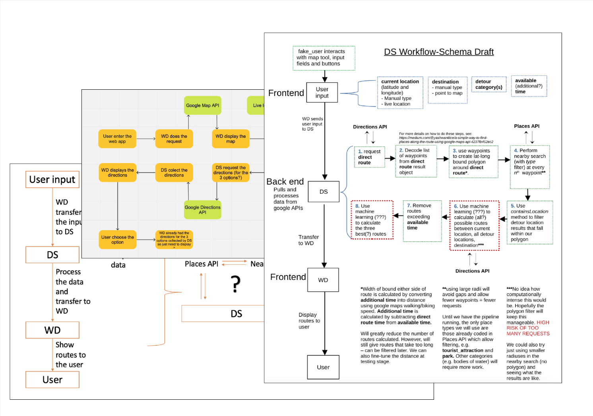
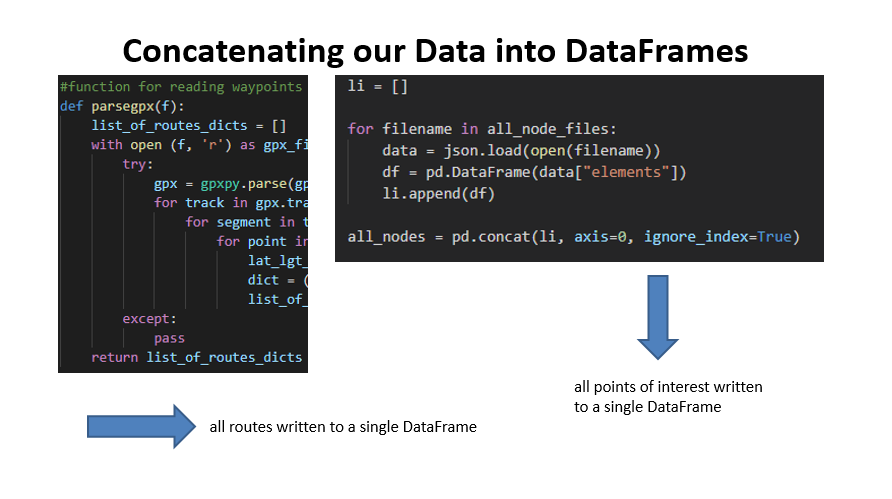
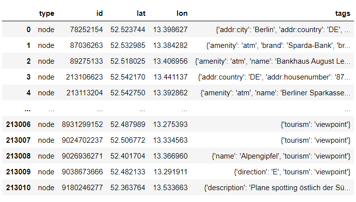
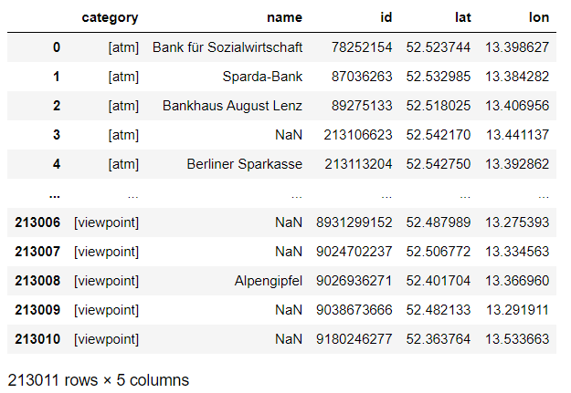
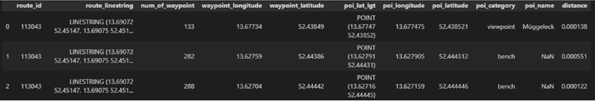
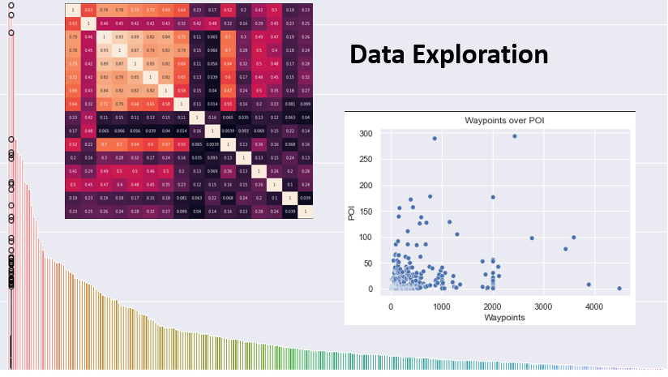
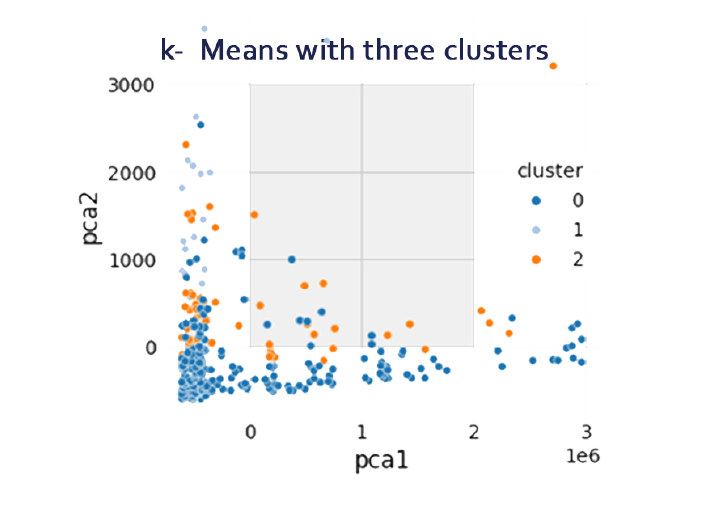
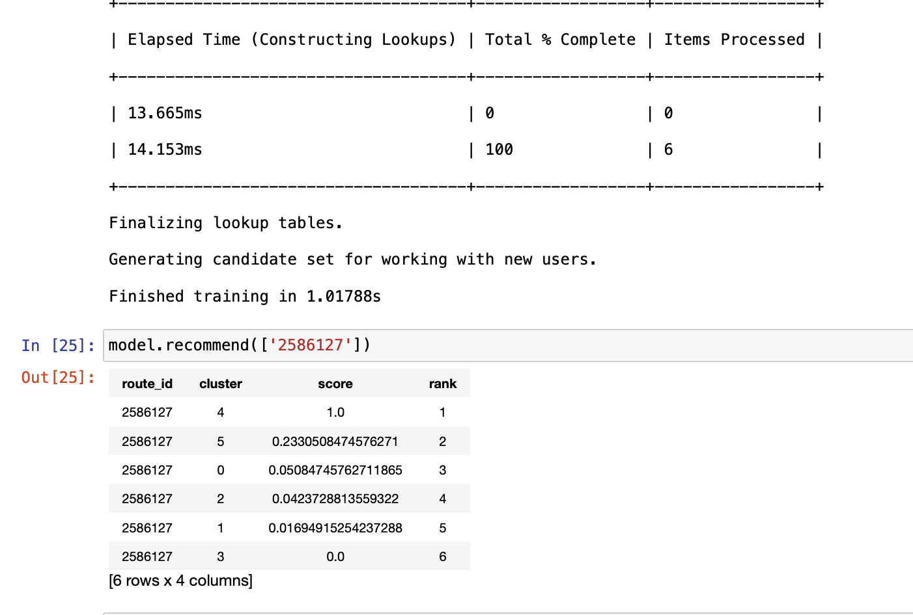

   

A different Way To Go to your final destination.

Way To Go is a personalised, map based web app that provides route recommendations in Berlin, based on a user's interests. You tell us what you feel like and we'll tell you the **Way To Go!**

## Introduction

Everyone has their daily commutes, and usually people rush to their destinations as fast possible. Sometimes, though, people might be early for an appointment, or be on holiday, and have time to spare on their way from A to B. How many times has it happened to you that you find out, months later, that you could have taken a 5-minute detour on your daily walk to pass by an open air gallery? On days where you have 10, 20 or 30 minutes to spare, would you not rather walk a beautiful or interesting route than arrive at your destination too early? Platforms like Google Maps, which only give you the fastest, most direct and non-personal route suggestions, offer no solutions.

This is what 8 passionate TechLabs students, under the capable guidance of a mentor, sought to address by creating Way To Go. Asking users to choose what they would like to see, based on pre-defined route profiles, the app returns personalised route options in Berlin based on location and destination, displaying it on a map for the user to follow and enjoy new views and places on the way to their final destination.

Read on for an in-depth dive into our process of planning and implementing the project, as well as the challenges and bottlenecks we faced.

## Our Journey

### The Beginning

The first step was to define what we wanted to reach with the project. We did some brainstorming sessions, using Miro boards, where we defined the essential functions, timelines and the MVP.

It was after this that our main pressing points showed up - being a project that requires quite a few requests, not only between Front- and Backend, but also with Google APIs, we got a bit confused about how the whole information would circulate i.e. how our production chain would work.

Thus, the whole group joined to start drawing and discussing a prototype to better understand this structure. From this point on, things got a bit clearer and work started showing up.

*Workflows-Schemas created by the group*

We'll now now talk through the process from the perspectives of each track.

### UX

**Members:** [Sueon Ahn](https://www.linkedin.com/in/sueonahn/), Paula Sebastiano

**Tech Stack:** Miro, Figma, Adobe Photoshop, Notion, SurveyMonkey

The first step that we had to do was defining the problem: "There is no map app that provides a personalised route, which can suggest a recommendation and a route at the same time". In order to get a better understanding of potential users' needs, we decided to conduct in-depth interviews, targeting Berlin residents aged 20-40.

The goal of the interview is to understand when, how, how often participants navigate with maps and which challenges they have while using it, and to examine general opinion of participants regarding a personalised map. As the interview consisted of 16 questions and had a high possibility of leading to follow-up questions, in-person interview was the preferred format. In case this was unavailable due to pandemic or other reasons, respondents would submit their opinions through SurveyMonkey. With the collected data, Personas and User stories were created. In addition, Affinity Mapping was done to organise responses in groups.

Through affinity mapping, several important components for users were shown up, such as

- Good recommendation is a key for user satisfaction → well-established and appropriate data analysis is imperative
- Many people find 'time saving' as a strength → the app should react in a couple of seconds
- Not only static points, some users are also interested in live events → getting related information from different platforms is required

Besides juggling around user data, competitive analysis was carried out in order to examine similar apps and to understand their strengths and weaknesses. By exploring a webpage of BVG (major transportation in Berlin), Roadtrippers (road trip planning tool), and Google Maps (web mapping platform), we started working on low-fidelity and high-fidelity wireframes on [Figma](https://www.figma.com/embed?embed_host=notion&url=https%3A%2F%2Fwww.figma.com%2Ffile%2FntRot2xviamxAUrRwP0aDS%2FWTG---FINAL-PROTOTYPE%3Fnode-id%3D86%253A1754).

As we worked on a prototype on Figma, we constantly communicated with Frontend developers, in order to check the process and investigate what could be done and what couldn't. Together with the Frontend developers, the prototype was further optimised to meet the app's functionalities.

Once the prototype is fully implemented, we are planning to carry out user testing.

### Web Development (WD)

**Members:** [Leonel Acosta](https://github.com/Leonel-Acosta), [Leonor Cascais](https://github.com/cleonor), [Sara Pulido](https://github.com/sara01rizo)

**Tech Stack:**

- ReactJS: Create React-App
- CSS, Bootstrap, React-Bootstrap, React-Icons: Style and Layout
- React-Google-Maps: To load Google Maps API script and calculate directions
- use-places-autocomplete: To provide intelligent places suggestions and geocode them
- Axios: To create HTTP Request
- React Router: for routing in React
- SweetAlert2: replace Java Script pop-up boxes

From the very beginning, we were keen to practise and deepen our knowledge of the tools we'd acquired during the academic phase (also considering what we thought was achievable in 7 weeks) - that's why we decided to stick to the basics and frameworks we'd already started to learn. It was an easy and consensual decision, and from that point on we were ready to start working.

Regarding our work, we couldn't wait for the UX team to give us the wireframes, or the DS team to send us the data to start working, so we started organising what could be done without these parts:

- It's a project that requires a map –> we started researching and exploring the best and free available options for map visualisation libraries;
- We choose to work with Google maps - it was the best option where we could use both the map and the directions service -> we started setting up the API key and preparing the code to display the map;
- We'll always have to ask for the user's origin and destination –> we prepared the inputs to ask origin and destination and display search suggestions;
- We would eventually need to make requests to the BE -> we prepared the request with Axios to them taking the user origin and destination.

*Landing page evolution*

And that was when we started getting information from both our UX and DS colleagues.

From the UX team we now had the Figma screens and user flow designed, so we started designing all the pages based on that: Landing page, Home, How it Works, About us, Contact and the page with the Map and the routes, all of those with the header and footer.

With the DS team we first had the Flask framework, that we could connect to its path and assure a request with a response. After that, we got hardcoded static points that allowed us to start linking different categories with different points – and this was a very important moment for us, because we now knew that we could display an alternative route suggestion to the user based on the category selected.

We had planned to create a web-app, being responsive also to mobile version. Unfortunately, due to schedule reasons we didn't have time to fully finish the mobile version, but the team still plans to do it after the deadline.

The decision of choosing the tools we learnt during the academic phase turned out to be a good decision since we reached a solid final project which we are all proud of and now we can also be confident with these tools.

*Current landing page*

### Data Science (DS)

**Members:** [Emilio Flores Bartelt](https://github.com/floresbar), [Merve Busra Duman](https://github.com/mervebduman), [Stefanie Senger](https://github.com/StefanieSenger)

**Tech Stack:** Python, Pandas, NumPy, Matplotlib, Shapely, Flask, SQLite3, Seaborn, Scikit-learn, Turicreate, Jupyter Notebook

As complete beginners, we were totally lost at the start of the journey. Since the original project pitch was not made with a data-driven approach in mind, we didn't have any data to process, and didn't even know where to start looking. After a lot of thinking, researching and trialling various approaches (which turned out not to be data driven - see 'workflow-schemas' under 'The Beginning', above), we decided to reach out to our track leads who gave us the idea to make route predictions based on previous routes, rather than creating routes based purely on location, destination and points of interest ('POI'). One month into the project, we had finally found our own "way to go".

Max from the TechLabs Team scraped about 20000+ routes data for us from Wandermap.net and 16 POI categories data from OpenStreetMap. We finally had data, and the cleaning could begin.

First, we concatenated the routes data and POI data into a single DataFrame each.

Since the POI categories were all hidden in the depths of a JSON file as dictionary values and keys, we had to do some extensive cleaning to extract the features we needed.

Similarly, the routes we received in GPX format were a nightmare to try to fit into a DataFrame, and we spent a lot of time trying with both wide and long format. We ended up with a huge DataFrame one row per route waypoint of every route.

After a lot of research, we discovered GeoPandas - a library (almost too good to be true) which allowed us to join our POI data with route waypoints on nearest geometry (a GeoPandas feature).

*Joined dataset*

At this point, it was time to understand our data more deeply - so we did some statistical analysis and visualisation using Matplotlib and Seaborn

As mentioned, until now our data had been organised by waypoint, rather than by route. As such, in preparation for ML, we grouped our data by route ID and performed value counts for every category, before joining everything together into one DataFrame by Route ID with 16 features (a count value for every category of POI it contained)

After another round of insightful office hours, we ploughed ahead to attempt to implement a classification/recommendation system in time for the final deadline.

Since we didn't have labelled data, we couldn't pursue supervised algorithms taught in the learning track. Thus, we first applied KMeans clustering on our data to get true labels. Then, using those clusters, we implemented a classification method. Moreover, we also implemented a recommendation system using Turicreate to recommend similar clusters (route categories) as a return to a route ID request.

*Extraction of absolute Numbers of Points of Interest*

Because our ML models were not ready for recommending personalised routes (we still didn't have great clusters and hadn't finished the recommendation algorithm, and one of our team got sick with Covid) we decided to use predetermined routes for our final presentation demonstration. Having already built a flask app to communicate with Frontend using a test API with hard coded POI, we proceeded to convert our .csv database into SQL so that Flask could communicate with it. For the final demonstration, although not sensitive to location and destination, the app was able to return four different routes from our database, depending on the category request received from Frontend.

Next, we will continue to work on the machine learning algorithms and develop them further, to the point that we will be able to link up the clusters we found to the category requests from Frontend in order to filter routes, as well making a recommendation based on desired start and end point. Lastly, we would like to go back and improve our data by including POI data that we received as polygons (for now we just used nodes - single co-ordinate points) for the place type categories we scraped. After that, the possibilities for new categories and data sources are endless!

In summary: there is much to improve, and we are eager to carry our app to the next level!

## Final Thoughts

We are very grateful to our mentor Kate Borovikova and the TechLabs team who supported us and helped us make Way To Go come alive for our portfolios.

Of course we are thinking about the future of Way To Go, and we would like to make the version more user friendly, with more features, such as adding the 'random category' feature suggested in the UX prototype, and eventually to deploy the whole project..

Although the road was paved with doubts, like the lack of a Data Set with enough information that took too much time, with all our combined efforts, we managed to develop and deliver the project. As beginners facing the challenge of working in a large team, all of us new to our own technologies (let alone each others'!), we feel incredibly proud of what we have achieved in such a short space of time. In the end it was a unique, immense and incredible experience, and we look forward to taking Way To Go to even greater heights.
